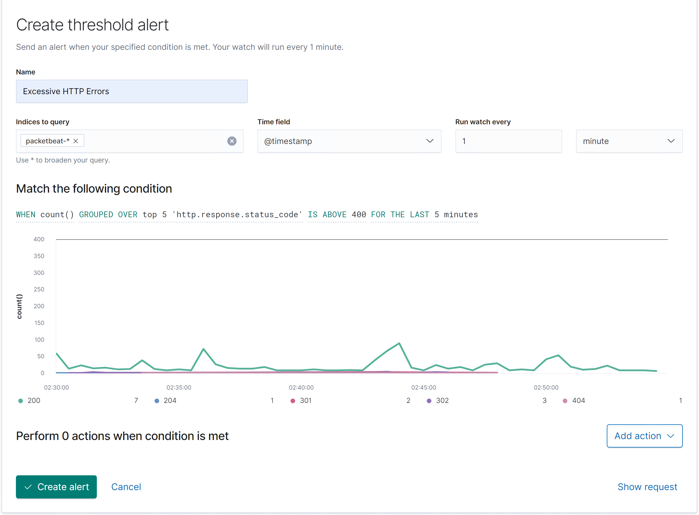
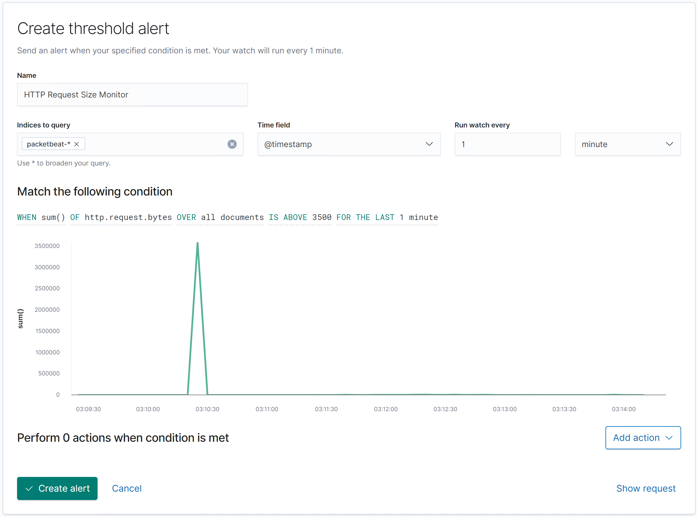
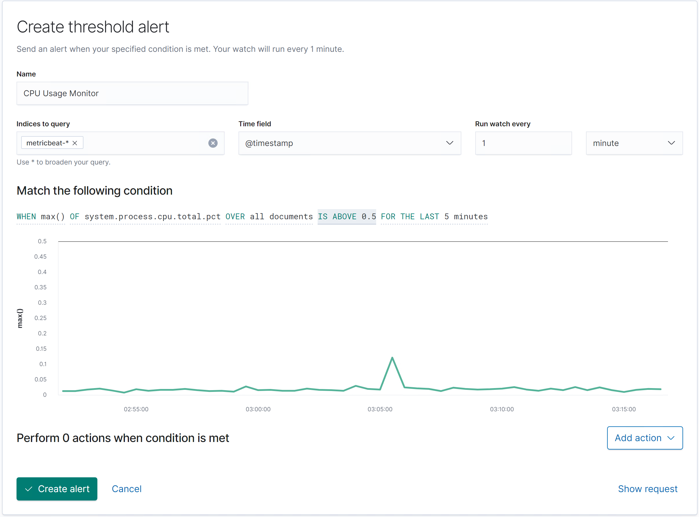

# Blue Team: Summary of Operations

## Table of Contents
- Network Topology
- Description of Targets
- Monitoring the Targets
- Patterns of Traffic & Behavior
- Suggestions for Going Further

### Network Topology
The following machines were identified on the network:
- Host Machine : ML-REFVM-684427
  - **Operating System**: Windows 10
  - **Purpose**: Contains the Hypervisor for all of the other VMs.
  - **IP Address**: 192.168.1.1
- Name of VM 2 : Kali
  - **Operating System**: Linux
  - **Purpose**: Attacker machine
  - **IP Address**: 192.168.1.90
- Name of VM 3 : Capstone
  - **Operating System**: Linux
  - **Purpose**: Used as a testing system for alerts
  - **IP Address**: 192.168.1.105 
- Name of VM 4 : ELK
  - **Operating System**: Linux
  - **Purpose**: It holds the Kibana dashboards that are pulling information from the different beats set up on the Victim Target VMs.
  - **IP Address**: 192.168.1.100
- Name of VM 5 : Target 1
  - **Operating System**: Linux
  - **Purpose**: The VM with WordPress as a vulnerable server Sends log files to ELK.
  - **IP Address**: 192.168.1.110 
- Name of VM 6 : Target 2
  - **Operating System**: Linux
  - **Purpose**: Exposes a vulnerable WordPress server. Sends logs to ELK.
  - **IP Address**: 192.168.1.115  

### Description of Targets
The target of this attack was: `Target 1` 192.168.1.110.

Target 1 is an Apache web server and has SSH enabled, so ports 80 and 22 are possible ports of entry for attackers. As such, the following alerts have been implemented:

### Monitoring the Targets ###

Traffic to these services should be carefully monitored. To this end, we have implemented the alerts below:

### Excessive HTTP Errors ###

Excessive HTTP Errors is implemented as follows:
    
    WHEN count() GROUPED OVER top 5 'http.response.status_code' IS ABOVE 400 FOR THE LAST 5 minutes

  - **Metric**:  Packetbeat : count() GROUPED OVER top 5 'http.response.status_code' IS ABOVE 400 
  - **Threshold**: Status codes of above 400 for the last 5 minutes
  - **Vulnerability Mitigated**: Enumeration/Brute Force
  - **Reliability**: High Reliability - This alert depends on server to report back error codes (4xx/5xx). There are not a lot of false positives.

### HTTP Request Size Monitor ###
HTTP Request Size Monitor is implemented as follows:

    WHEN sum() of http.request.bytes OVER all documents IS ABOVE 3500 FOR THE LAST 1 minute

  - **Metric**: Packetbeat :  sum() of http.request.bytes OVER all documents IS ABOVE 3500 
  - **Threshold**: http.request size > 3500 bytes in the past minute
  - **Vulnerability Mitigated**: Cross-Site Scripting Code injection in HTTP requests (XSS and CRLF) 
  - **Reliability**: Medium Reliability - This alert is using the http.request size to determine whether a malicious request has been made to the server. While a 3500 byte size request may be large, there may be reasons that a user would need to upload a file of that size (e.g. if you needed to upload a profile picture). For this reason, this would be considered a medium reliability alert as there may be some necessary use cases of large file requests.

### CPU Usage Monitor ###

CPU Usage Monitor is implemented as follows:

    WHEN max() OF system.process.cpu.total.pct OVER all documents IS ABOVE 0.5 FOR THE LAST 5 minutes

  - **Metric**: Metricbeat : max() OF system.process.cpu.total.pct OVER all documents
  - **Threshold**: ABOVE 0.5 FOR THE LAST 5 minutes - CPU Process Percentage about 50% for the last 5 minutes
  - **Vulnerability Mitigated**: Excessive CPU usage due to potential rogue program running (such as a virus or malware). 
  - **Reliability**: Medium Reliability - This alert may be fired on initial boot up of the targets when there are many processes first getting launched/ran. Also, under a large load, the CPU usage may increase. Depending on the normal baseline usage, the percentage may need to be modified.

### Suggestions for Going Further (Optional)

- Each alert above pertains to a specific vulnerability/exploit. Recall that alerts only detect malicious behavior, but do not stop it. For each vulnerability/exploit identified by the alerts above, suggest a patch. E.g., implementing a blocklist is an effective tactic against brute-force attacks. It is not necessary to explain _how_ to implement each patch.

The logs and alerts generated during the assessment suggest that this network is susceptible to several active threats, identified by the alerts above. In addition to watching for occurrences of such threats, the network should be hardened against them. The Blue Team suggests that IT implement the fixes below to protect the network:
- Vulnerability 1 : Brute Force Attacks/DDOS
  - **Patch**: Install and configure an IPS
  - **Why It Works**: An IPS can be used to determine if a certain IP address is trying to flood the system or is using the same request signature to connect to the system. If this is detected, the IPS can automatically flag the IP and blacklist/block it to prevent it from accessing the system.

- Vulnerability 2 : HTTP Request Size/XSS
  - **Patch**: Implement both client side and server side validations on files that are being uploaded. 
  - **Why It Works**: Only certain file formats should be allowed to be uploaded to the webserver. If the user tries to upload a non-standard file (such as a .js file, or a .php/html file) then the browser should automatically disallow the transaction from completing via client-side validation. 
  
- Vulnerability 3 : Malware/Rogue Program
  - **Patch**: Install a rootkit scanner such as chkrootkit with `sudo apt install chkrootkit`. Enable system scanning with lynis `sudo apt install lynis`.
  - **Why It Works**: `chkrootkit` will scan the system and make sure there have been no installed rootkits on the system. `lynis` will perform system health scan of systems to support system hardening and compliance testing. It can be used to determine any existing vulnerabilities that can be exploited.
