# Network Forensic Analysis Report

## Time Thieves 
You must inspect your traffic capture to answer the following questions:

1. What is the domain name of the users' custom site? 
    - Using the filter `ip.addr ==  10.6.12.0/24` you can see the domain name to be `frank-n-ted.com`
2. What is the IP address of the Domain Controller (DC) of the AD network?
    - The IP Address of the DC is `10.6.12.12`

    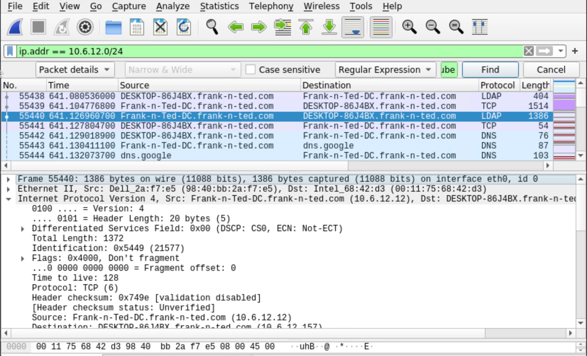

3. What is the name of the malware downloaded to the 10.6.12.203 machine?
   - Once you have found the file, export it to your Kali machine's desktop.
        - Using the filter `ip.addr == 10.6.12.203 && http.request.method == GET` we can see the file downloaded was `june11.dll`

    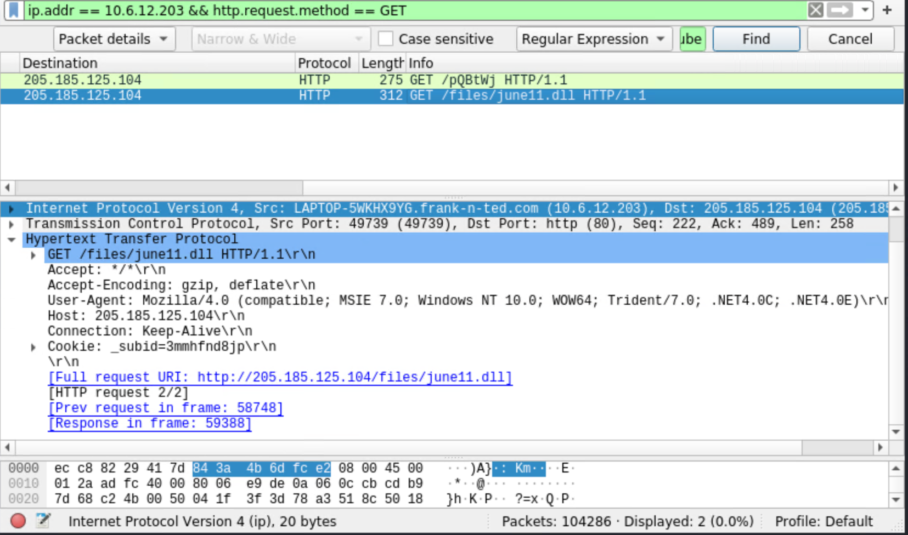

4. Upload the file to [VirusTotal.com](https://www.virustotal.com/gui/). 
    - To Export I did File -> Export Objects -> HTTP -> june11.dll

    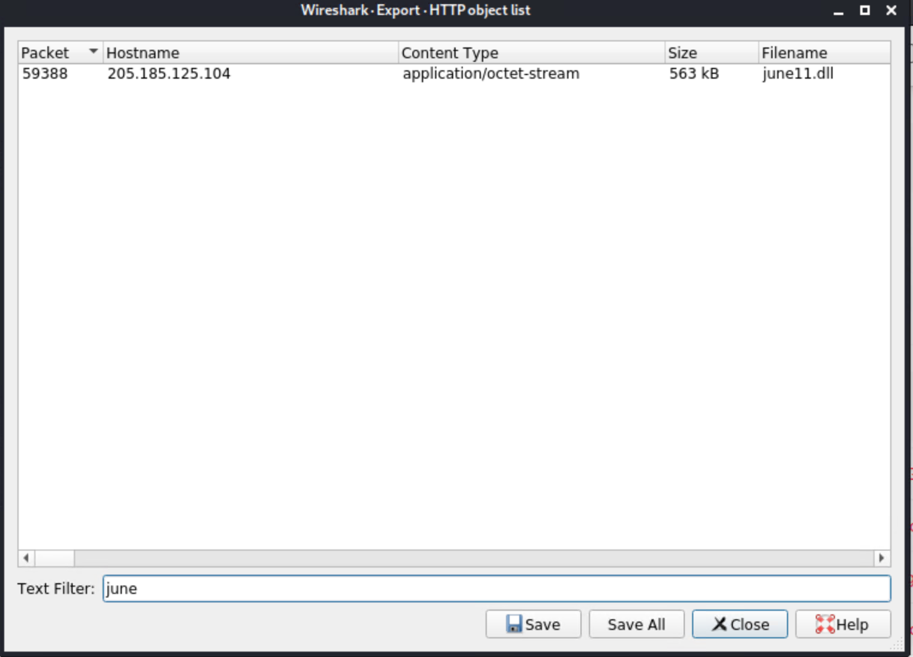

5. What kind of malware is this classified as?
    - This file is classified as a Trojan by most vendors. Microsoft, and a few other vendors, however classified this as a Ransomware. (Micosoft Ransom:Win32/Locky)

    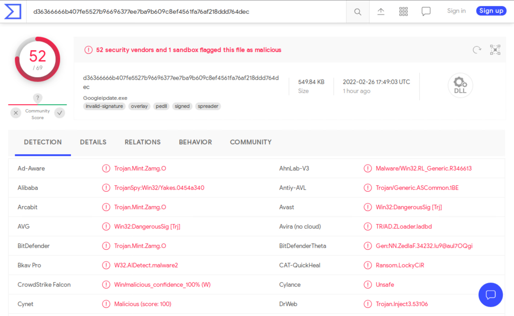

---

## Vulnerable Windows Machine

1. Find the following information about the infected Windows machine:
    - Host name : `Rotterdam-PC`
    - IP address : `172.16.4.205`
    - MAC address : `00:59:07:b0:63:a4`

    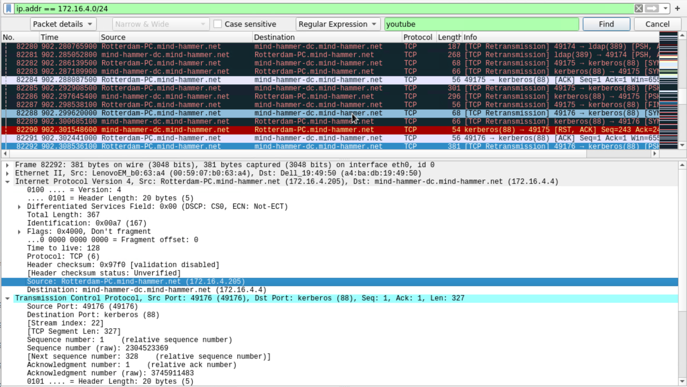

2. What is the username of the Windows user whose computer is infected?
    - Using filter: `ip.addr == 172.16.4.0/24 && kerberos.CNameString && !(kerberos.CNameString contains $)`, 
        I found the username to be matthijs.devries

        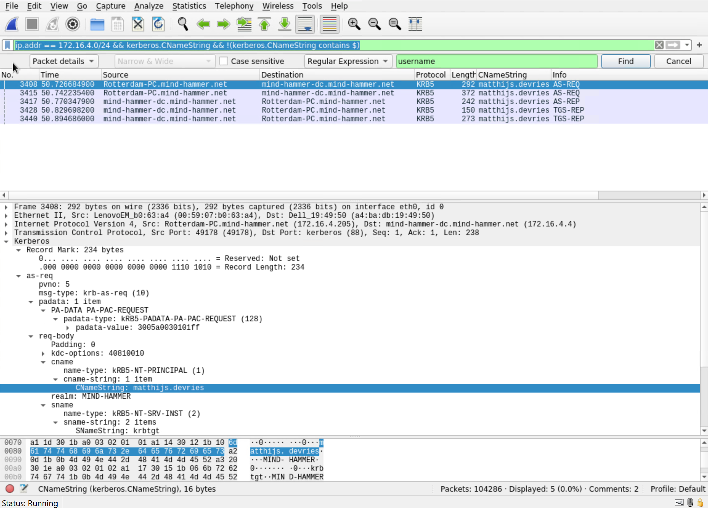
    
        Reference:
        https://unit42.paloaltonetworks.com/using-wireshark-identifying-hosts-and-users/

3. What are the IP addresses used in the actual infection traffic?
    - The main IP adresses used in the infection were `166.62.111.64` and `185.243.115.84`. It seems that `166.62.111.64` initially infected the `Rotterdam-PC`. The `Rotterdam-PC` then seems to have spread the infection to the IP address `185.243.115.84`.

    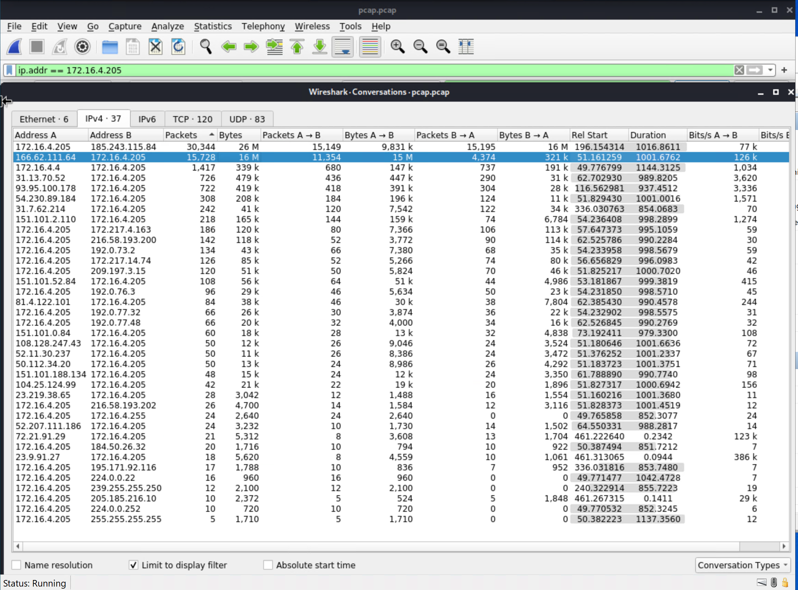

4. As a bonus, retrieve the desktop background of the Windows host.
    - Export the largest file. It's a picture of a bird as a Windows desktop background.

    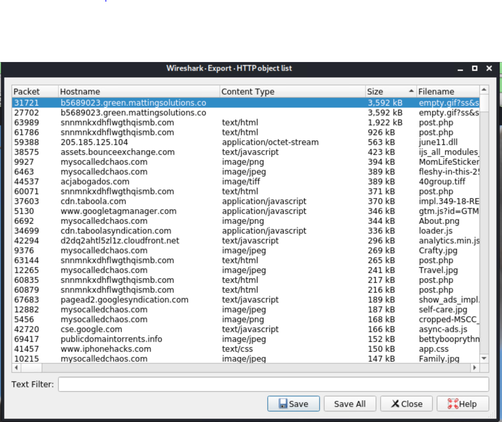

    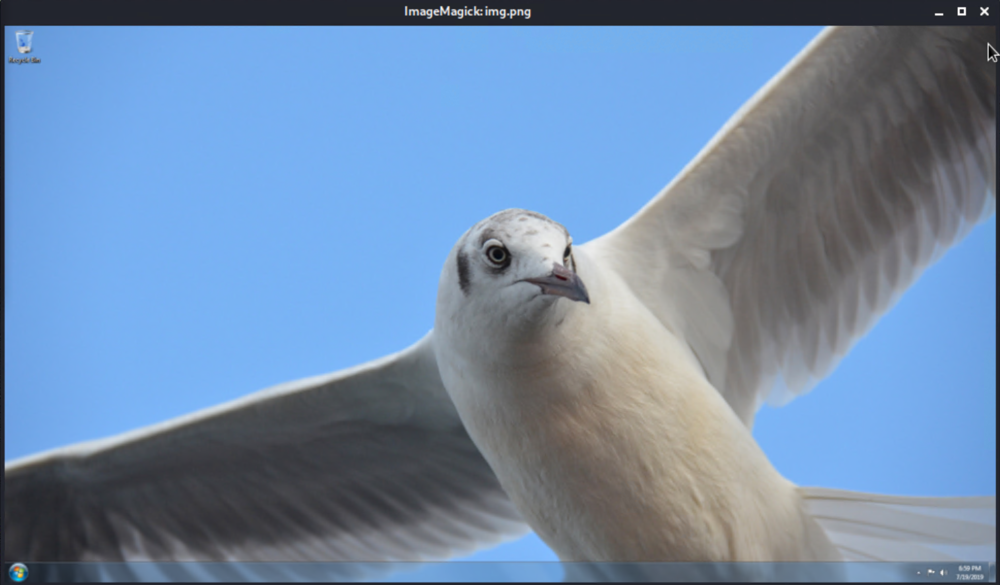
---

## Illegal Downloads

1. Find the following information about the machine with IP address `10.0.0.201`:
    - MAC address : `00:16:17:18:66:c8`
    - Windows username : `elmer.blanco`
    - OS version : From the http request User-Agent we can see the user agent as Mozilla/5.0 (Windows NT 10.0; Win64; x64). This means the OS is a 64 bit version of Windows 10.

    - `ip.addr == 10.0.0.201 && kerberos.CNameString && !(kerberos.CNameString contains $)` was used to find the MAC address and Windows username
    - `ip.addr == 10.0.0.201 && http.request.uri contains tor` was used to get the OS version
    
    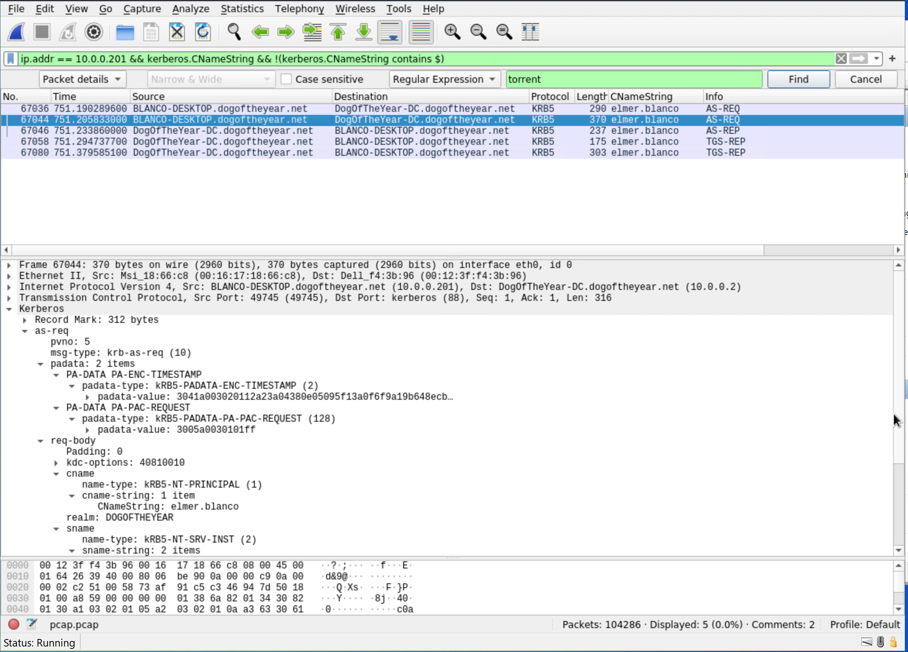

    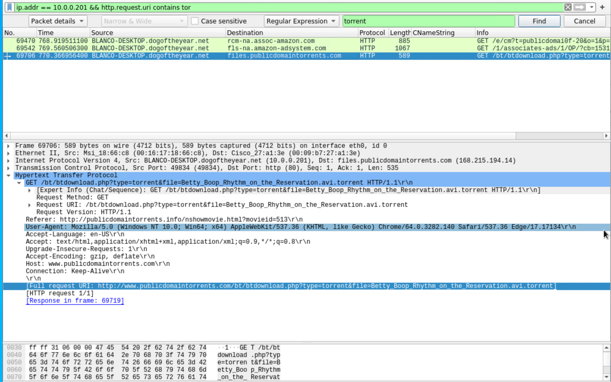

2. Which torrent file did the user download?

    - Using filter: ip.addr == 10.0.0.201 && http.request.method == GET && http.request.uri contains .tor

    - The file downloaded was: `Betty_Boop_Rhythm_on_the_Reservation.avi.torrent`

    

